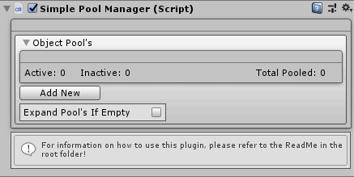

# SimplePoolManager
Pool Manager plugin for unity with a custom inspector.

# Overview: 
This is a simple pool manager that allows you to pool any unity GameObject with ease. Has a custom built inspector for easy use and has the option to expand the pools if they run out.
This tool is free to use with any type of projects weather pro or personal.

# How To Install:
You can download the unity package which contains the scene and the plugin scripts themselves from [here](https://github.com/ddark1990/SimplePoolManager/blob/master/SimplePoolManager-Goomer.unitypackage),
or you can clone the entire project if you wish. Once you have the package open up Unity and go to Assets in the top left corner, then import package, then import custom package.

# How To Use:
In the Prefabs folder there is a prefab called PoolManager which you can just drag into your scene and start using.
Check "Expand Pools If Empty" if you want you're pools to auto expand beyond the designated value.

In script just use the SimplePoolManager.Instance.SpawnFromPool(poolName, pos, rot); method to spawn from the pool and SimplePoolManager.Instance.ReturnToPool(obj); to return the object back for reuse, without return to pool method, the object will NOT go back to the queue unless you enqeue it yourself another way.

Exposed (Public) Variables: 
* (List) Pools - All the actual queue pools which contains all the objects
* (Dictionary) PoolDictionary - Dictionary of all the pools that get tagged based on the pools objects name.
* (int) ActiveObjects - Integer of all active objects from the pools.
* (int) InactiveObjects - Interger of all inactive objects.
* (int) TotalPooledObjects - Interger of the total objects created throughout all the pools.

# Interface:
Its interfaced for OnObjectSpawn & OnObjectDespawn with IPooledObject which you can add to any object that you are pooling to get subscribe to those events.

# Disclamer
Right now you cannot add pools at runtime very easily.
